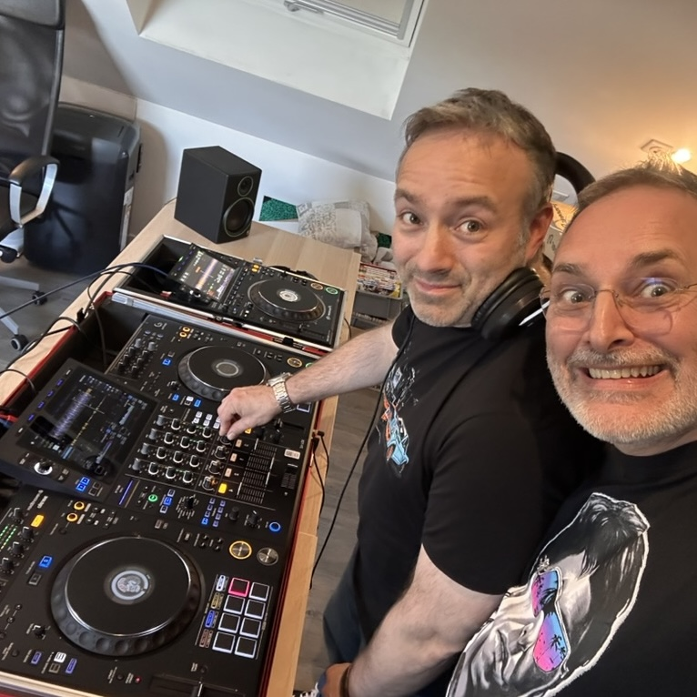

Recorded from home studio, Cergy. On Alphateta [XDJ-AZ](https://alphatheta.com/fr/product/all-in-one-dj-system/xdj-az/black/) and 2 [CDJ-3000](https://www.pioneerdj.com/fr/product/dj-players-turntables/cdj-3000/).
4 hands.

